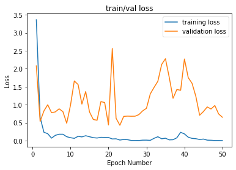
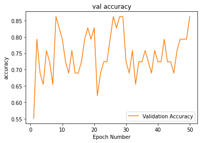

# Thyroid Nodule Cytology Classification

Graduate research project, Sharif University of Technology (2021). Supervisor: Dr. Hamid Reza Rabiee.

Fine-needle aspiration (FNA) cytology is the reference test for deciding whether a thyroid nodule is benign or malignant, and each slide takes a cytopathologist significant time to review. This project is a first prototype of a deep learning classifier for **benign vs malignant thyroid cytology images**.

## What I did

- **Built the dataset.** I extracted labelled thyroid FNA cytology images from the [Papanicolaou Society of Cytopathology atlas](https://www.papsociety.org/), assigned each image a benign/malignant label based on the atlas diagnosis, and organised them into a training set: **328 images (196 malignant, 132 benign)**. The label file is in [`data/labels.csv`](data/labels.csv).
- **Augmentation.** Because the dataset is small, training images are augmented on the fly with random horizontal flips, rotations up to 180° and brightness/contrast jitter (cytology images have no fixed orientation, and staining varies between labs).
- **Model.** Transfer learning with an ImageNet-pretrained **GoogLeNet** (PyTorch / torchvision), fine-tuned end to end at 512×512 with Adam (lr 1e-3, batch size 32, 50 epochs). The checkpoint with the best validation accuracy is kept.
- **Evaluation.** A fixed held-out test split (29 images), with 10% of the remaining images used for validation. Reported metrics: accuracy, sensitivity, specificity, precision and F1.
- **Proposal.** I also wrote the research proposal for the larger project, which planned to extend the dataset with about 1,000 expert-labelled clinical samples and add interpretability so that the model's decisions could be checked by cytopathologists.

## Results

Confusion matrices from the notebook run (positive class = malignant):

| Split | Images | TP | TN | FP | FN | Accuracy | Sensitivity | Specificity | Precision | F1 |
|---|---|---|---|---|---|---|---|---|---|---|
| Validation | 29 | 14 | 11 | 2 | 2 | 0.86 | 0.88 | 0.85 | 0.88 | 0.88 |
| Test | 29 | 20 | 7 | 2 | 0 | 0.93 | 1.00 | 0.78 | 0.91 | 0.95 |

Precision and F1 above are recomputed from the confusion matrices; the stored notebook output used an earlier, incorrect precision formula (since fixed in the code).

**Limitations.** The test set is very small (29 images), so these numbers have wide uncertainty. The validation loss is noisy, and atlas images are curated, textbook-quality examples, so performance on real whole-slide clinical images would likely be lower. This is why the proposal planned clinical data and interpretability as next steps.

<p float="left">
  
  
</p>

## Data

The images are **not included** in this repository because they belong to the atlas. To reproduce the dataset, download the thyroid cytology images from the Papanicolaou Society of Cytopathology atlas, name them as in `data/labels.csv` (`BENIGN (n).jpg`, `MALIGNANT (n).jpg`; label 1 = malignant, 0 = benign), zip them, and update the paths in the data-loading cells. The notebook was run on Google Colab with the data in Google Drive.

## Repository structure

```
notebooks/
  thyroid_googlenet_classification.ipynb   # data loading, augmentation, training, evaluation
data/
  labels.csv                               # image file names and benign/malignant labels
images/                                    # figures used in this README
requirements.txt
```

## Tech

Python, PyTorch, torchvision, scikit-learn, scikit-image, pandas, NumPy, Matplotlib, Google Colab (GPU).

## Author

Bahar Jahani · [LinkedIn](https://www.linkedin.com/in/bahar-jahani-a711a81b3)
